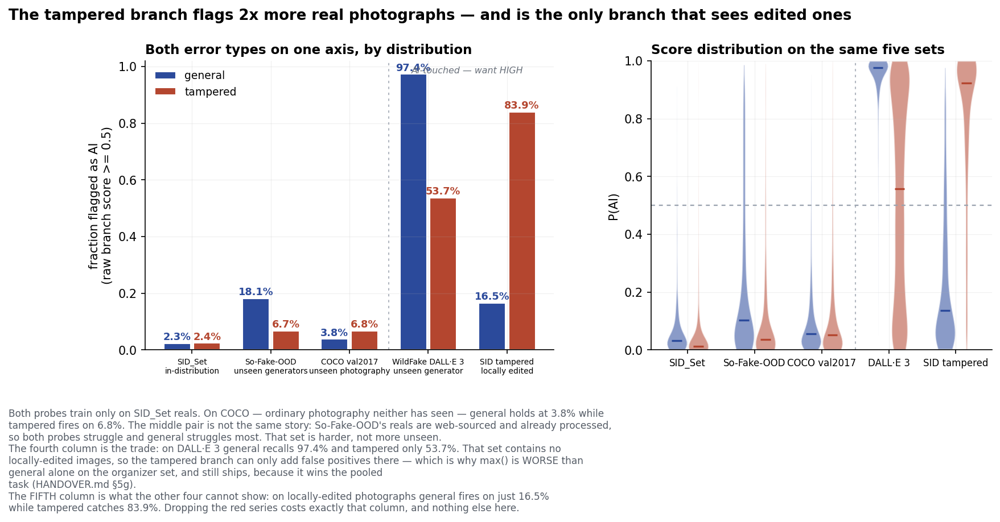
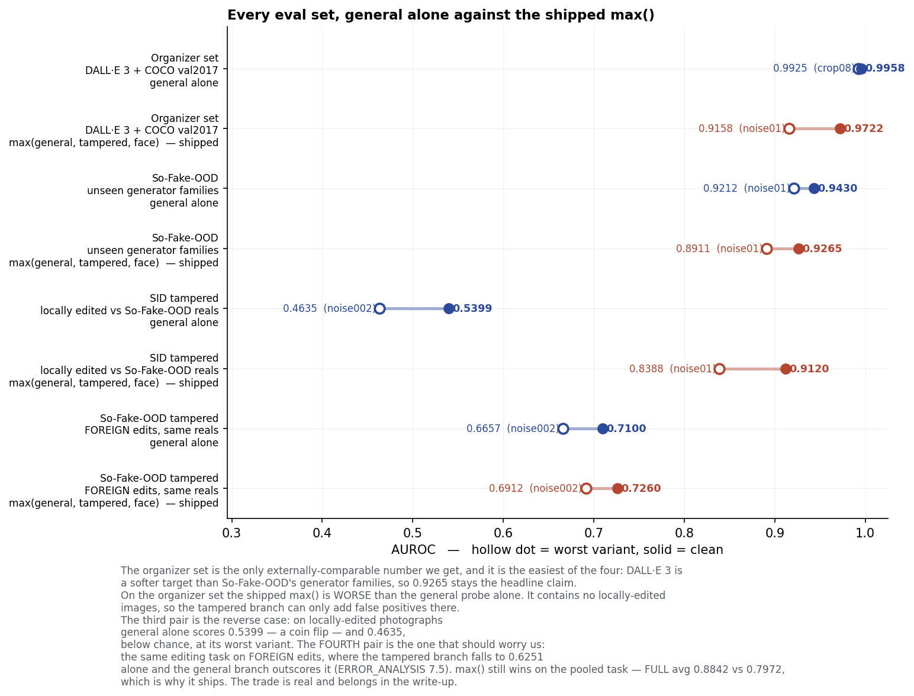
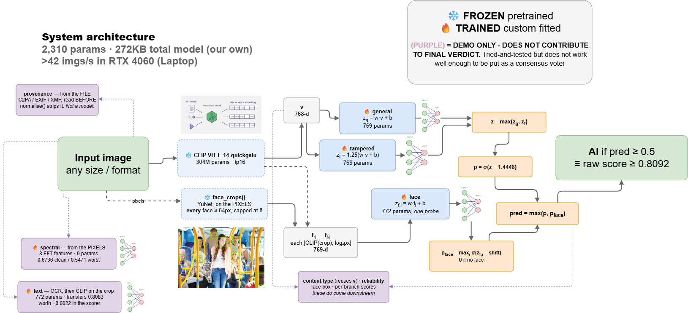
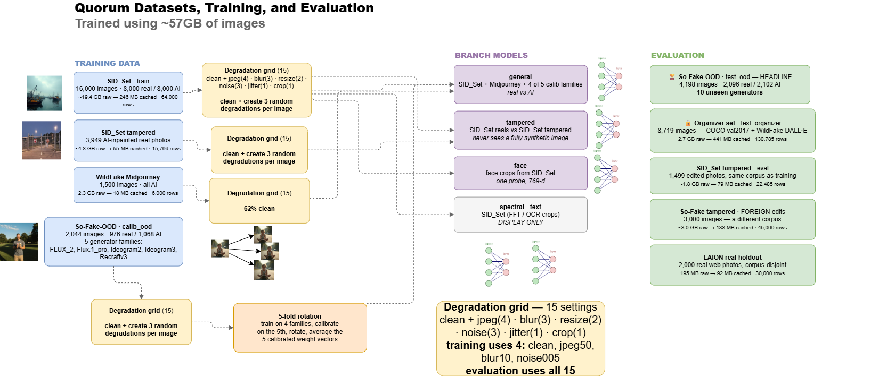

<p align="center">
  
</p>

<h1 align="center">Quorum</h1>

<p align="center">
  <b>Robust detection of AI-generated images</b><br>
  It keeps working after the image has been compressed, blurred, resized, noised, colour-shifted or cropped.
</p>

<p align="center">
  
  
  
  
  
  
</p>

```bash
python predict.py --input-dir path/to/images --output preds.json
# [{"image_path": "path/to/images/001.jpg", "pred": 0.87}]
```

One frozen CLIP backbone with three linear probes on top, **2,310 trained parameters** in total, 11 KB on disk. We combine them with a plain `max` instead of a learned meta-classifier. We did build the meta-classifier first, but it scored 0.8511 against `max`'s 0.8597, so it didn't make the cut.

## 🎯 Results

| eval set | n | AUROC | ACC | PREC | RECALL | F1 |
|---|---|---|---|---|---|---|
| 🏆 **So-Fake-OOD clean** *(headline — 10 unseen generator families)* | 4,198 | **0.9265** | 0.8380 | 0.9021 | 0.7588 | 0.8243 |
| So-Fake-OOD, all 15 variants | 62,970 | 0.9206 | 0.8221 | 0.9076 | 0.7177 | 0.8016 |
| Organizer set, clean † | 8,719 | 0.9722 | 0.9185 | 0.8872 | 0.9266 | 0.9065 |
| Organizer set, all 15 † | 130,785 | 0.9594 | 0.8989 | 0.8675 | 0.9005 | 0.8837 |
| SID_Set tampered, clean | 3,595 | 0.9120 | 0.8473 | 0.8665 | 0.7492 | 0.8036 |
| **Foreign tampered, clean** ‡ | 5,096 | **0.7260** | 0.5608 | 0.8464 | 0.3103 | 0.4541 |

† This one is DALL·E 3 against COCO, and the brief says it won't count toward scoring. It's the friendlier number, so **quote 0.9265, not 0.9722.**
‡ This is the tampered branch tested on somebody else's edits. It gets 0.91 on the corpus it trained on and 0.7260 on a different one, so we report both rather than just the good one.

**Per branch, clean → worst of 15** ([full grid](docs/robustness.md)) — `general` 0.9245 → 0.9013 · `face` 0.9421 → 0.9168 · `tampered` 0.9528 → 0.8962 · `spectral` 0.6736 → 0.5471 *(display only)*.


Rows are sorted by how far they fall from clean. Worth a second look: the `face` row goes *up* under blur. That's the probe picking up a shortcut, not it being robust, and we chased down why in [`HANDOVER-MODELS.md`](docs/HANDOVER-MODELS.md).

### 📉 Against published detectors

We downloaded both at their released weights and ran them **here**, on the same pixels we score: 600 COCO val2017 reals against 600 WildFake DALL·E fakes, which are in nobody's training set ([method](docs/BASELINES.md)).

| detector | clean | jpeg30 | blur20 | resize025 | noise005 | mean | drop |
|---|---|---|---|---|---|---|---|
| **Quorum** | **0.977** | 0.983 | 0.953 | 0.974 | 0.947 | **0.967** | **0.030** |
| FatFormer (CVPR'24) | 0.646 | 0.883 | 0.252 | 0.302 | 0.515 | 0.520 | 0.394 |
| CNNDetection (CVPR'20, crop) | 0.586 | 0.527 | 0.505 | 0.506 | 0.521 | 0.529 | 0.081 |
| CNNDetection (resize) | 0.390 | 0.378 | 0.324 | 0.314 | 0.451 | 0.371 | 0.076 |

If a detector works by reading high-frequency generator artifacts, JPEG q30 wipes those out. FatFormer actually *inverts* under blur: it calls blurred DALL·E images real more often than it calls real COCO photographs real. In fairness it beats us on the older GAN families and loses on the 2025 generators, and both halves are in `docs/BASELINES.md`.

### 🎚️ Where the decision is actually made

AUROC doesn't care where you put the threshold, so it can't tell you whether the cut you actually shipped is any good. Ours wasn't. 0.5 was just the sigmoid's default, nobody chose it, and at that cut we were flagging **26.7% of ordinary photographs** as AI.


This plots every threshold-dependent metric against the threshold. The amber curve is the one we weren't watching. We picked the new cut *without* looking at either eval curve: it's cross-validated over five generator families, and each fold is scored on the family it never trained on.

<details>
<summary>📊 <b>Three more figures from the error analysis</b> — the branch trade, the score distributions, and the cases we get wrong</summary>

**Both error types on one axis.** The tampered branch flags 6× more real photographs than `general` does, and it's also the only branch that catches edited ones at all. If we dropped it we'd lose the fifth column and nothing else.



**Every eval set, `general` alone against the shipped `max()`.** The organizer set is the one case where `max()` is *worse* than the general probe on its own. There are no edited images in it, so the tampered branch has nothing to catch and can only add false positives. We still ship it, because it wins once you pool all the tasks together.



**The distributions behind those curves**, and then the actual images we get wrong:


</details>

## 🧠 System architecture



Blue boxes are frozen, orange is just arithmetic, and **purple is demo-only — none of it reaches `pred`**. Every image gets embedded once by a **frozen CLIP ViT-L/14-quickgelu** (OpenAI weights, 304M params, fp16, 768-d and L2-normalised). We never fine-tune it. Three linear probes read that embedding:

| branch | input | params | question |
|---|---|---|---|
| `general` | 768-d image embedding | 769 | fully synthetic? |
| `tampered` | 768-d image embedding | 769 | contains an AI-edited region? |
| `face` | 769-d = CLIP(face crop) + standardised `log₂(face_px)` | 772 | is any face synthetic? |

```
pred = max( σ(max(z_general, 1.25·z_tampered) − SHIFT),  max_i p_face,i )
```

- 🔀 **"AI-generated" is really two questions.** A fully synthetic image and a real photo with an inpainted patch are opposite problems. Our general probe gets **AUROC 0.37 on edited photographs**, which is worse than chance — and it's right to, because an edited photo *is* globally authentic. The answer we want is "synthetic **or** edited", and a linear model in log-odds can't express an "or".
- 🎚️ **0.5 is a real operating point, not the sigmoid's default.** We shift the score so the cut lands on `OPERATING_POINT = 0.8092`, picked on a set whose generator families don't overlap training. The shift is monotone, so AUROC doesn't move at all. It takes precision from 0.766 to 0.902 and cuts false accusations by about 3×.
- 👥 **We score every face, not just the biggest one.** YuNet finds each face ≥ 64 px, up to 8 of them. One synthetic face is enough to call the image.
- 🧪 **Robustness is measured on a grid, not claimed.** 15 settings, seeded on each image's content hash so a rerun gives the same thing. We also ran all 196 composed pairs: stacking two transforms costs ~0.013 AUROC, so degradation **doesn't compound** the way we expected.
- 🔎 **We read provenance but never score it.** `quorum/provenance.py` pulls C2PA, EXIF, XMP and PNG text out of the *original bytes*. It stays out of `pred` for three reasons: it's null on 100% of our eval rows, it has ~0 recall once a platform has touched the file, and anyone can forge it. The demo shows it as an unvalidated claim.

<details>
<summary>🚫 <b>What didn't work</b> — five of sixteen negative results</summary>

| attempt | result |
|---|---|
| OCR features for garbled text | **0.4627 — below chance**; 5 of 6 features flip sign across datasets, falsifying our own design doc |
| CLIP on warped text crops | Works (0.8083 transfer) but worth **+0.0022**, and misses the gap it was built for |
| More real-photo diversity for `tampered` | False positives got **worse**, 13.6% → 53.5%, while its AUROC *rose* |
| Learned fusion meta-classifier | 0.8511 vs `max`'s 0.8597 |
| 2026-generator data as a 6th branch | −0.0211, and it would have *spent* an unseen generator we evaluate on |

All sixteen: [`docs/ERROR_ANALYSIS.md`](docs/ERROR_ANALYSIS.md) §8.
</details>

## 🖥️ The demo

It's a Flask app on a single origin, running as a Docker Space on HF's free CPU tier. You upload an image and it gives you the verdict plus the reasoning behind it: per-branch scores, the face box, a CLIP zero-shot content label, a degradation estimate, the spectral and text display signals, and whatever provenance was in the file.

- **If a branch can't measure an image, it says so instead of guessing.** No face in the frame gives you `face: null`, never `face: 0`.
- **The uncertainty band is earned, not decoration.** We report 0.40–0.60 as uncertain because accuracy inside that band is **0.5229** against **0.8726** outside it.

## ⚠️ Limitations

1. **What we miss depends on how *recent* a generator is, not which family it's from.** GPT-image-2 gets past us **70.2%** of the time against GPT-4o's 15.9%; nano_banana_2 is 59.4% against nano_banana's 14.0%. It's a distribution problem rather than a backbone one — a probe trained on those families reaches 0.84–0.97, so CLIP does encode the artifacts.
2. **On photography from a corpus we've never touched we falsely accuse 19.50%**, not the 8.25% the operating point is anchored to. We report both, and only tune against the anchor.
3. **The `tampered` branch learned a dataset rather than a concept.** 0.91 on the corpus it trained on, 0.7260 on a different one. We kept it anyway, because dropping it takes edited-photo AUROC down to 0.5286, which is a coin flip.
4. **There's no explainability beyond the per-branch scores.** We designed patch-level scoring for this and never got to build it.
5. **We know how to close part of the gap and decided not to.** Training on the held-out families lifts the four worst generators by **+0.0559** and even lowers false positives. It also retires the unseen-generator evaluation that gives every number here its meaning, so we left it alone.

## ⏭️ Given more time

Roughly in the order we'd actually pick them up.

1. **Patch-level self-consistency.** Score 3×3 patches against *each other* instead of against some global idea of what "real photography" looks like. It is the proper fix for our biggest failure, `tampered` firing on 24.2% of ordinary photographs, and it also gives us a **heat map**, which is the explainability we are missing. No new parameters, same frozen CLIP, just 9× the forward passes.
2. **Retrain `tampered` on two corpora at once.** It gets 0.91 in-corpus and 0.7260 out because it learned how SID_Set *builds* its edits. Fitting it on SID and So-Fake edits together is the direct test of whether that generalises.
3. **Close the recency gap without burning an eval generator.** Adding 2026 generators to training made things worse (−0.0102), partly because we filtered the wrong subset. Whatever we try next has to source those generators from a corpus we do *not* evaluate on, or the headline stops meaning "unseen".
4. **Actually measure the multi-face `max`.** It shipped unmeasured because every face corpus we have is one face per image. To settle it we would need a face-swap set *with bystanders in the frame*.
5. **Make the figures reproduce the shipped scorer exactly.** `make_figures.py` and `pick_threshold.py` work off cached embeddings, so they cannot see the face branch and understate us by ~0.0013. The caches already exist, so this is a join rather than new compute.
6. **Rerun the composed-degradation test at n=200 instead of n=50.** Right now the standard error is wider than the spread of the table it produces.
7. **Actually validate C2PA signatures** instead of reading strings out of the CBOR, so provenance stops being an unvalidated claim.
8. **Batch the demo's three CLIP passes into one.** That roughly halves the per-upload wait on a free CPU Space.

## 🛠️ Built with

**We do not call any external inference APIs.** Everything runs locally. The only network calls are dataset streaming at build time and the one-off CLIP weight download.

| model | role | frozen? |
|---|---|---|
| **CLIP ViT-L/14-quickgelu** (`openai`, via `open_clip_torch`) | the only feature extractor, 304M params | frozen |
| **YuNet** (`yunet.onnx`, 227 KB, OpenCV Zoo) | face detection + alignment | frozen |
| **RapidOCR PP-OCRv4** | text location, demo signal only | frozen |
| `general` / `tampered` / `face` `.npz` | the shipped scorer — 769 / 769 / 772 params | **ours** |
| `spectral` (9) · `text_crop` (772) `.npz` | demo display signals, never in `pred` | **ours** |

**Model / data** — `torch` ≥2.6 · `open_clip_torch` · `numpy` · `pandas` · `pyarrow` · `scikit-learn` · `Pillow` · `opencv-python` · `datasets` · `huggingface_hub` · `tqdm` · `matplotlib`
**Demo** — `Flask` 3 · `gunicorn` · `opencv-python-headless` · `rapidocr_onnxruntime` (optional) · vanilla HTML/CSS/JS, no build step
**Tooling** — Python 3.13 + `venv` · VS Code · Claude Code (co-author on 29 of 70 commits) · Git + GitHub, PR-based · `ruff` · Docker · HF Hub (streaming + a private 2.01 GB embedding cache) · HF Spaces · diagrams.net, `.drawio` generated from code · one RTX 4060 Laptop 8 GB

Things we deliberately did not use: no fine-tuning framework, no experiment tracker, no training loop. Everything we trained is a linear fit that takes seconds on CPU.

## 📊 Dataset



**487,636 manifest rows · 51,905 unique images · 10 sources · 15 variants each.** We read ~57 GB of source imagery **once** and turn it into **2.01 GB of embeddings**, which is why the whole project fits on a laptop.

<details>
<summary>Per-source roles and counts</summary>

| dataset | role | n (clean) |
|---|---|---|
| **SID_Set** | primary training — real vs fully-synthetic; also face crops and spectral features | 16,000 |
| **SID_Set tampered** | trains `tampered` — AI-inpainted real photographs | 3,949 |
| **WildFake — Midjourney** | generator diversity for `general` | 1,500 |
| **So-Fake-OOD** `calib_ood` carve | calibration + a 4-of-5-family training rotation | 2,044 |
| COCO train2017 reals | tried as extra negatives, **reverted** — it worsened false positives | 5,000 |
| 🏆 **So-Fake-OOD** `test_ood` | **the headline** — 10 generator families absent from training | 4,198 |
| 🔒 **Organizer validation** (COCO val2017 + WildFake DALL·E) | the brief's benchmark, **quarantined** | 8,719 |
| **SID_Set tampered** eval | edited photos, same corpus as training | 1,499 |
| **So-Fake tampered** eval | edited photos, **foreign corpus** — the honest number | 3,000 |
| **LAION-5B real holdout** | false positives on an unfamiliar *corpus* | 2,000 |

`scripts/build_manifest.py` **asserts** that no image and no generator family crosses the train/eval line. We split the calibration carve by generator *family* rather than by generator, because putting Ideogram2 and Ideogram3 on opposite sides would let us call a sibling model "unseen". Layout is in [`docs/DATA_LAYOUT.md`](docs/DATA_LAYOUT.md).
</details>

**Assets:** `data/models/*.npz` (7 files, ~34 KB, tracked) · `yunet.onnx` (227 KB) · `test-images/`. No corpus imagery is in this repo.

## 📄 Licences

The code is **MIT** ([`LICENSE`](LICENSE)), but that does not relicense the data underneath it. **So-Fake-OOD is CC BY-NC 4.0 and `general.npz` trains partly on its `calib_ood` carve, so the shipped weights are NON-COMMERCIAL.**

<details>
<summary>Per-asset licences</summary>

| asset | licence | consequence |
|---|---|---|
| SID_Set | CC BY 4.0 | attribution |
| **So-Fake-OOD** | **CC BY-NC 4.0** | **`general.npz` is non-commercial** |
| WildFake | none stated on the ModelScope mirror used | research use only |
| COCO 2017 | images under original Flickr terms; annotations CC BY 4.0 | attribution |
| LAION-5B | CC BY 4.0 metadata; images linked, not owned | — |
| CLIP ViT-L/14, open_clip · YuNet (OpenCV Zoo) | MIT | — |
| RapidOCR / PP-OCRv4 | Apache 2.0 | — |

`tampered.npz`, `face.npz`, `spectral.npz` and `text_crop.npz` only train on SID_Set, so they need attribution but are not non-commercial. The embedding cache lives in a **private** HF repo and we never redistribute it; `.dockerignore` is an allowlist that enforces this as a build assertion. There is no TikTok branding anywhere in the repo or the demo.
</details>

## 📁 Structure

```
robust-ai-image-detection/
├── predict.py              # the deliverable: dir -> preds.json, and the ONE definition of the score
├── quorum/                 # the library
│   ├── detectors/          # general · tampered · face · spectral · text (train entry points)
│   ├── embed.py            # frozen CLIP pass, shard writer, image ids
│   ├── degrade.py          # the 15-setting robustness grid, seeded per image
│   ├── calibrate.py        # Platt, folded into the saved weights
│   ├── features.py         # face crops, spectral features
│   ├── fusion.py           # the learned combiner we measured and didn't ship
│   └── provenance.py       # C2PA / EXIF / XMP, read but never scored
├── scripts/                # build_manifest · eval_grid · compare_baselines · selfcheck · figures
├── app/                    # Flask demo over the real probes
├── data/models/*.npz       # the shipped scorer, 34 KB, tracked
└── docs/                   # results, handover, spec, error analysis
```

## 👥 Team

**Adriel Jansen Siahaya** — data pipeline, embedding, manifest, evaluation, error analysis · **Albert Ariel Putra** — general probe, spectral · **Kacey Isaiah Yonathan** — face probe, text, calibration and fusion · **Michael Cenreng** and **Valentino Nathan** — demo backend and frontend.

## 📚 Documentation

| | |
|---|---|
| [`ERROR_ANALYSIS.md`](docs/ERROR_ANALYSIS.md) | required deliverable — scorecard, failure by transform / generator / content, case studies, sixteen negative results |
| [`robustness.md`](docs/robustness.md) | required deliverable — AUROC per branch under all 15 settings |
| [`BASELINES.md`](docs/BASELINES.md) | Quorum vs CNNDetection and FatFormer, run here |
| [`SPEC.md`](docs/SPEC.md) · [`PIPELINE.md`](docs/PIPELINE.md) · [`DATA_LAYOUT.md`](docs/DATA_LAYOUT.md) | architecture, model input contracts, data |
| [`HANDOVER.md`](docs/HANDOVER.md) · [`HANDOVER-MODELS.md`](docs/HANDOVER-MODELS.md) | the working record, including what failed |
| [`DEPLOY.md`](docs/DEPLOY.md) · [`RUNBOOK.md`](docs/RUNBOOK.md) | deploying the demo; running the data pass |

---

# 🚀 Development

```bash
git clone https://github.com/adrieljss/robust-ai-image-detection && cd robust-ai-image-detection
python -m venv .venv && .venv\Scripts\activate      # source .venv/bin/activate on mac/linux
pip install torch --index-url https://download.pytorch.org/whl/cu130   # NVIDIA GPU: FIRST
pip install -r requirements.txt
python -c "import torch; print(torch.cuda.is_available())"             # must print True
hf auth login
export QUORUM_CACHE_REPO=techjam2026blueberryjam/quorum-cache   # $env:... on PowerShell
python scripts/pull_cache.py          # ~2GB of embeddings, no images
```

```python
from quorum.detectors.general import load
X, rows = load("sid_train")     # X (N,768) aligns 1:1 with rows
```

Always use `load()` rather than `np.load` or `load_source`. It drops re-embedded duplicates and cross-split leaks, and it takes `split` from the manifest instead of the shard ([`HANDOVER.md`](docs/HANDOVER.md) §1).

> **Rules.** `train` trains; `calib` and `calib_ood` fit calibrators and fusion only; `test_ood` and `test_organizer` are never fitted on, ever. `calib_ood` is carved out of So-Fake-OOD by generator family, so selecting rows by `source == "so_fake_ood"` without filtering `split` trains on your own eval set — **filter by split, always**. Every `train_*.py` requires `--manifest`. Never train on `data/raw/organizer_val/`. Do not re-run the embedding pass — it changes everyone's numbers.

## 🔁 Reproducing the results

Every number in this README comes back out of the cache. We did not hand-type any of
them: the figures and diagrams import their constants straight from `predict.py`, so
they cannot outlive the model they describe.

```bash
python scripts/pull_cache.py                       # embeddings, ~2GB, no images

python predict.py --input-dir test-images --output preds.json   # the deliverable
python scripts/selfcheck.py --all                  # every assertion, ~90s

python scripts/eval_grid.py                        # -> docs/robustness.md   (deliverable 4)
python scripts/eval_grid.py --source organizer_val # -> docs/robustness-organizer_val.md
python scripts/pick_threshold.py                   # the operating point, 0.8092
python scripts/chain_eval.py --n 50                # composed degradation pairs
python scripts/make_figures.py                     # -> docs/figures/*.png (all six)
python scripts/error_cases.py                      # -> docs/figures/error-cases.png
python scripts/compare_baselines.py                # -> docs/BASELINES.md
```

`eval_grid.py` refits from the cache every run instead of reading the shipped `.npz`,
so a stale weight file cannot quietly flatter the table. Retraining a branch is a
separate command on purpose (`python -m quorum.detectors.general`) because it
overwrites `data/models/`, which is why the self-check never calls it.

## 🧪 Tests

```bash
python scripts/selfcheck.py         # offline, ~30s -- runs on a fresh clone
python scripts/selfcheck.py --all   # + the checks that read data/cache, ~90s
```

One command, one exit code. The offline set runs without the cache or a GPU, because the probes it scores with are tracked in git and the 2 GB cache is not.

<details>
<summary>What each check catches</summary>

| check | what fails if it breaks |
|---|---|
| `predict.py --self-check` | the operating point stops landing on 0.5; the shift stops being monotone; `max` quietly becomes something else; the output contract (two fields, posix paths, five extensions, nested dirs) drifts; a private copy of the scoring path in `scripts/` diverges from `score_embeddings` |
| `quorum.degrade` | the 14-setting grid, or its per-image seeding |
| `quorum.embed` | image ids stop being format-stable; shard order is lost |
| `quorum.calibrate` | Platt stops improving ECE; calib_a/calib_b stops being a partition |
| `quorum.features` | spectral features go non-finite; a face is "found" in pure noise |
| `quorum.provenance` | a container parser breaks, or `normalise()` stops destroying the signal |
| `chain_eval` | the metric helpers, on populations where AUROC is undefined |
| `app/app.py --self-check` | `/api/analyze` stops rejecting bad uploads, or its response shape drifts |
| `build_manifest.py` *(--all)* | assertions A–F: organizer val leaks, the OOD carve overlaps, an image spans two splits |
| `general --check` *(--all)* | an image sits on both sides of the train/eval line |
| `spectral` *(--all)* | the calibration carve leaks back into the reported number |

`selfcheck.py` skips `quorum.fusion`, `quorum.detectors.face` and bare `quorum.detectors.general` on purpose. Those retrain and overwrite the shipped weights, so they are training entry points that happen to assert rather than tests. `quorum.detectors.text` gets skipped too unless `rapidocr_onnxruntime` is installed.
</details>

## 🔍 Inspecting single images

```bash
python scripts/try_face.py photo.jpg other.png --save-crops out/   # face + general probes
python scripts/try_grid.py photo.jpg [--chain]                     # 15 variants, or 196 pairs
python predict.py --input-dir test-images --output preds.json --provenance
```

`try_face.py` takes ~13 s to load the models and then ~50 ms per image, so pass all your images in one go.

## 🧹 Lint

Ruff, configured in `pyproject.toml`. `selfcheck.py` enforces `ruff check`. We left `ruff format` available but **not** enforced, because a Black-style pass rewrites 2,161 lines across 26 files and most of that is it collapsing hand-aligned tables like `quorum/degrade.py`'s `TRANSFORMS` into ragged single spaces. The rule set is only four families wide (`F`, `E9`, `E741`, `W`) for the same reason, and `pyproject.toml` records what we left out and why.

```bash
python -m ruff check .            # runs in selfcheck.py
python -m ruff format --diff .    # what the formatter would change
```

---

## 🧾 Fail note

All of this failed. We are listing it because a project that only shows you its wins
is not really showing you a result, it is showing you a selection.

### Ideas that were built, measured, and lost

| # | attempt | outcome |
|---|---|---|
| 1 | OCR features (6-d) for garbled text | **0.4627 — below chance.** Five of six features flip sign across datasets |
| 2 | CLIP on warped text crops | Transfers at 0.8083, but worth **+0.0022** and does not close the text gap it was built for |
| 3 | Text crops across the 15-variant grid | 0.8284 → **0.5229**; OCR detection collapses to 48.2% and its missingness is label-correlated 3.63:1 |
| 4 | Text consistency as a concept | 2 of 6 sampled real COCO text regions are photographer watermarks — the detector answers "was this composited?", not "was this AI?" |
| 5 | Retrain `tampered` on more real-photo diversity | False positives got **worse**, 13.6% → 53.5%, while its own AUROC *rose*. Data is not the lever |
| 6 | ~~Face branch into `max()`~~ | **Overturned — it ships.** The original "wash" was an artifact of averaging over the 73% of images with no face |
| 7 | Face + spectral into `max()` | Clearly worse: 0.8914 / 0.8135 |
| 8 | Learned fusion meta-classifier | 0.8511 against `max`'s 0.8597 |
| 9 | Patch self-consistency | Mechanism confirmed, gate failed |
| 10 | Per-generator specialist zoo | Five one-generator probes maxed: **0.9042** vs one pooled probe's **0.9444**, and it loses *most* on the generator it was meant to rescue |
| 11 | Nonlinear head (MLP-64) | 0.9425 vs linear's 0.9444, at double the false positives. One linear boundary was never the bottleneck |
| 12 | A second foreign dataset (Midjourney) | +0.0307 on the organizer set, **−0.0013** on the headline. Content matching, not artifact learning |
| 13 | Per-content-bucket thresholds | Both objectives lose to a single global cut; equal-FPR is worse by 4.7pp |
| 14 | Hard-negative mining on COCO | Cuts COCO false positives 60% and an unfamiliar corpus's by 5%. It learned "these watermarks are real", not "watermarks are real" |
| 15 | **2026-generator training data** | **−0.0102** overall and unfamiliar-corpus FPR 18.05% → 25.15%. It gets *worse* with more data, and the thing it was meant to fix regresses too |
| 16 | The same data as a 6th branch instead | **−0.0211**, FPR → **28.30%** — twice as bad as pooling it |

Six branches have now failed to earn a place in `max()`, and all six were reading the
same 768-d features. The only one that ever made it in, `face`, brought different
features with it. Full working in [`docs/ERROR_ANALYSIS.md`](docs/ERROR_ANALYSIS.md) §8.
