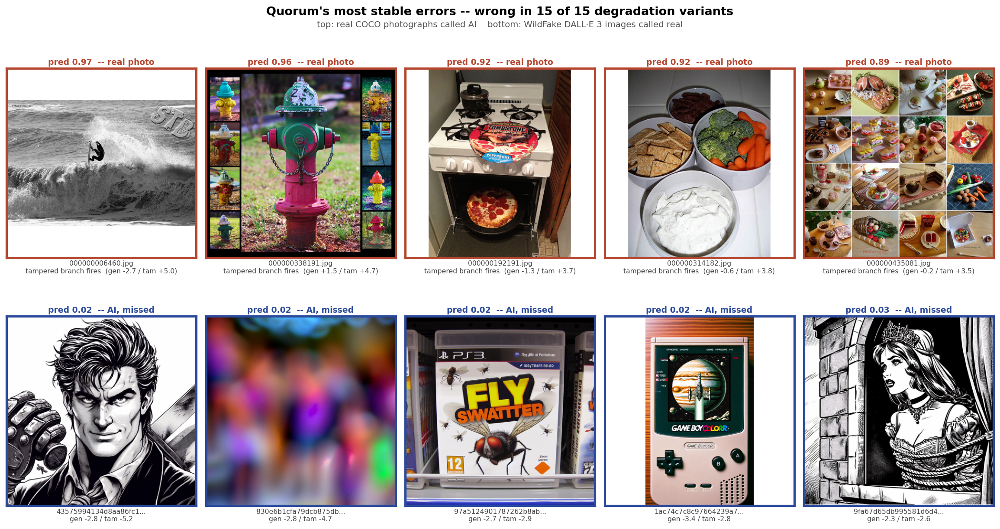

# Error Analysis Note

Required deliverable #5. Every number here is measured, none is asserted, and
each one names the script that reproduces it.

Scores come from `predict.score_embeddings` — the shipped scorer,
`max(general, 1.25 * tampered, face)` at `OPERATING_POINT = 0.8092`, so the threshold
below is always 0.5 on the emitted `pred`. Both constants changed on 30 Aug when
the probe was retrained (section 3.1); the figures import them from `predict.py`
rather than pasting them, so a figure cannot outlive the model it illustrates.

---

## 1. Where we stand

| eval set | n | AUROC | ACC | PREC | RECALL | F1 | FPR | FNR |
|---|---|---|---|---|---|---|---|---|
| **So-Fake-OOD clean** *(headline)* | 4,198 | 0.9265 | 0.8380 | 0.9021 | 0.7588 | 0.8243 | 0.0825 | 0.2412 |
| So-Fake-OOD, all 15 variants | 62,970 | 0.9206 | 0.8221 | 0.9076 | 0.7177 | 0.8016 | 0.0733 | 0.2823 |
| organizer set, clean † | 8,719 | 0.9722 | 0.9185 | 0.8872 | 0.9266 | 0.9065 | 0.0876 | 0.0734 |
| organizer set, all 15 † | 130,785 | 0.9594 | 0.8989 | 0.8675 | 0.9005 | 0.8837 | 0.1023 | 0.0995 |
| SID_Set tampered, clean | 3,595 | 0.9120 | 0.8473 | 0.8665 | 0.7492 | 0.8036 | 0.0825 | 0.2508 |
| **FOREIGN tampered, clean** ‡ | 5,096 | **0.7260** | 0.5608 | 0.8464 | **0.3103** | 0.4541 | 0.0806 | 0.6897 |

‡ Scored with **two** branches, not three: `so_fake_tampered_eval` was embedded
without face extraction, so no `face_*` cache exists for it. Face is applied
all-or-nothing per row set -- giving the borrowed reals face scores while the
tampered positives got none would add false positives with no possible rescues
and understate the scorer by ~0.009. `make_figures.py` prints a line when it
skips a row for this reason.

\* Those rows pit thousands of edited images against 2,096 reals. Precision and
accuracy there are imbalance artifacts; only AUROC, FPR and recall mean anything.

**Read the last two rows before quoting any of the others.** "FOREIGN tampered"
is So-Fake-OOD's own locally-edited class, embedded 30 Aug. It is the first
cross-dataset test the tampered branch has ever had, and it fails it -- see
section 7.5. Every SID_Set tampered number above is a *same-dataset* number.

**So-Fake-OOD is the honest headline** for the synthetic task. Different
datasets, different generator families, never trained on. The organizer set's
0.9719 is the friendlier number but it is WildFake DALL-E 3 against COCO
val2017 -- one generator against one photo corpus -- and the brief states it
"will not contribute to the final score", so it is a demonstration, not a claim.

**False accusations on real photography**, the number the operating point was
chosen to control:

```
laion5b holdout, clean     n=2,000   FPR 18.05%   <- CORPUS-DISJOINT, see 7.7
So-Fake-OOD reals, clean   n=2,096   FPR  8.25%   unseen images, shared corpus
COCO val2017 reals, clean  n=5,000   FPR  8.76%   corpus-disjoint again since 7.6 was reverted
```

**The reference pool changed on 30 Aug and this is the important line in the
document.** COCO val2017 used to be our unseen-photography number. It is not any
more -- the tampered branch trains on COCO train2017, so 2.32% is in-distribution
and flattering. **So-Fake-OOD reals are now the best pool we have** -- no image
in it is trained on, verified by hash and by embedding cosine -- and 8.25% is the
number to quote. The operating point is anchored to it.

Be precise about what that buys. It is *unseen images*, not an *unseen corpus*:
the `calib_ood` reals we train on come from the same So-Fake-OOD collection.
**On a genuinely unseen corpus of web photographs the rate is 19.50%** (7.7), and
that is the figure to quote for what a platform would experience. The operating
point is anchored to 8.25% because that pool is the largest one nothing trains
on; the holdout is reported, never tuned against.

---

## 2. Failure by transformation

The project's own thesis, so it goes first. AUROC across the organizers' 15-way
grid:

```
So-Fake-OOD     clean 0.9265   worst 0.8911 (noise01)   drop 0.0354
organizer set   clean 0.9722   worst 0.9158 (noise01)   drop 0.0564
```

Two things worth saying out loud:

- **Additive noise is the only transformation that really hurts.** `noise01` is
  worst on both sets, and every noise level ranks in the bottom four. Noise
  attacks the high-frequency band where generator artifacts live, and no
  amount of probe tuning recovers information that has been destroyed.
- **JPEG compression does not hurt at all.** On the organizer set `jpeg30`
  scores **0.9810**, *above* clean's 0.9719, and on So-Fake-OOD 0.9280 against
  0.9255. The transformation everyone assumes kills a detector is the one we are
  most robust to, because CLIP's own pretraining distribution is full of
  recompressed web images.

Full per-variant tables: `docs/robustness.md`, `docs/robustness-organizer_val.md`.
Figures: `docs/figures/robustness.png`, `robustness-organizer_val.png`.

---

## 3. Failure by generator

So-Fake-OOD `test_ood`, each generator family scored against all held-out reals.
The remaining five families (FLUX_2, Flux.1_pro, Ideogram2, Ideogram3,
Recraftv3) are the `calib_ood` carve and appear in no eval number.

| generator | n clean | AUROC | recall (clean) | recall (all 15) | **FNR** |
|---|---|---|---|---|---|
| GPT-image-2 | 123 | 0.8029 | 28.5% | 26.1% | **73.9%** |
| GPT-image-1.5 | 279 | 0.8413 | 40.1% | 35.4% | **64.6%** |
| nano_banana_2 | 85 | 0.8445 | 44.7% | 43.1% | **56.9%** |
| imagen3 | 227 | 0.9218 | 69.6% | 64.4% | 35.6% |
| Seedream3.0 | 280 | 0.9446 | 73.6% | 67.1% | 32.9% |
| seedream4.5 | 101 | 0.9503 | 74.3% | 68.3% | 31.7% |
| Imagen4 | 280 | 0.9570 | 78.6% | 72.0% | 28.0% |
| nano_banana | 136 | 0.9583 | 85.3% | 80.0% | 20.0% |
| GPT4o | 290 | 0.9679 | 84.5% | 79.3% | 20.7% |
| Hidream | 301 | 0.9681 | 86.7% | 83.9% | 16.1% |

**The failure tracks generator recency more than generator family** -- but the
pattern is weaker than it first looked, and the weakening is itself a result.

Two of three same-lab pairs still show the newer model beating us harder:
GPT-image-2 (73.9% FNR) against GPT4o (20.7%), and nano_banana_2 (56.9%) against
nano_banana (20.0%). The third **inverted** after the 30 Aug retrain:
seedream4.5 now scores 0.9503 against Seedream3.0's 0.9446, where before it was
0.8871 against 0.9328.

So the honest claim is narrower than "newer is always harder": *some* recent
generators are much harder, the effect is large where it appears (3-4x the FNR),
and it is not a fixed property of the generator -- more training breadth moved
one of the three across the line entirely. Reproduce: `scratchpad/errors.py`.

### 3.0 Being trained on a generator is worth ~0.017. Which generator it is swings 0.17

Section 3 reports only UNSEEN generators, which invites the reading that the
spread is about generalisation. It is not. `calib_ood`'s five families became
training data in 3.1, so they can be scored as an in-distribution baseline
against the same negative pool (`test_ood` reals, so only the positives differ):

| generator | status | n | AUROC | recall |
|---|---|---|---|---|
| Ideogram3 | **trained on** | 249 | 0.9654 | 89.2% |
| Recraftv3 | **trained on** | 289 | 0.9572 | 85.8% |
| FLUX_2 | **trained on** | 126 | 0.9424 | 77.0% |
| Flux.1_pro | **trained on** | 279 | 0.9120 | 72.8% |
| Ideogram2 | **trained on** | 125 | 0.8920 | 64.8% |
| Hidream | unseen | 301 | **0.9712** | 89.4% |
| GPT4o | unseen | 290 | 0.9678 | 87.9% |
| Imagen4 | unseen | 280 | 0.9603 | 86.4% |
| nano_banana | unseen | 136 | 0.9571 | 88.2% |
| seedream4.5 | unseen | 101 | 0.9551 | 85.1% |
| Seedream3.0 | unseen | 280 | 0.9442 | 78.6% |
| imagen3 | unseen | 227 | 0.9209 | 76.7% |
| nano_banana_2 | unseen | 85 | 0.8502 | 49.4% |
| GPT-image-1.5 | unseen | 279 | 0.8421 | 50.2% |
| GPT-image-2 | unseen | 123 | **0.8006** | 38.2% |

```
mean AUROC   trained-on 0.9338   unseen 0.9169   gap 0.017
mean recall  trained-on 77.9%    unseen 73.0%
```

**The best unseen generator beats every trained-on one**, and Ideogram2 -- which
is in our training set -- ranks 8th of 15, below seven generators we have never
seen. Training on a generator is worth about **+0.017**; the choice of generator
is worth **0.17**, ten times more.

So the failures in section 3 are mostly *hardness*, not *unfamiliarity*. That
matters for planning: adding a hard generator to training should be expected to
buy ~0.02 on that generator, not to fix it. Ideogram2 is the counter-example
sitting inside our own training set. Reproduce: the block in this section's
commit message, or re-derive with `predict.score_embeddings` grouped by
`R.generator` against `test_ood` reals.

### 3.1 It is a distribution problem, not a backbone problem

Two hypotheses fit the table above. Either a frozen 2023 CLIP does not
*represent* a 2026 generator's artifacts — in which case no linear probe on top
can ever find them — or it does, and our probe was simply never shown them.

`calib_ood` is this project's one sanctioned training exception and holds five
generator families (FLUX_2, Flux.1_pro, Ideogram2, Ideogram3, Recraftv3) the
shipped probe has never seen. Adding them to `sid_train` — 2,044 images, variant
density matched so they cannot outvote 16,000 by carrying 3.75x the rows each —
and re-scoring `test_ood`, which is still never trained on:

| generator | shipped | +5 families | Δ |
|---|---|---|---|
| GPT-image-2 | 0.8047 | 0.8381 | **+0.0335** |
| nano_banana_2 | 0.8315 | 0.8935 | **+0.0620** |
| GPT-image-1.5 | 0.8339 | 0.8764 | **+0.0425** |
| seedream4.5 | 0.8856 | 0.9710 | **+0.0854** |
| imagen3 | 0.9382 | 0.9517 | +0.0135 |
| Seedream3.0 | 0.9472 | 0.9627 | +0.0155 |
| Imagen4 | 0.9613 | 0.9740 | +0.0127 |
| nano_banana | 0.9654 | 0.9719 | +0.0065 |
| GPT4o | 0.9687 | 0.9792 | +0.0105 |
| Hidream | 0.9701 | 0.9776 | +0.0075 |

Overall `test_ood` clean **0.9245 → 0.9469**, and the gain lands exactly where
the pain is: **+0.0559 on the four worst generators, +0.0111 on the six best**.

Three findings, each load-bearing:

- **The backbone is not the ceiling.** Train on one `calib_ood` family, test on
  held-out rows of that same family: 0.8385 – 0.9719. CLIP does encode these
  artifacts. The probe had not been shown them.
- **It is free on the false-positive axis.** COCO FP at matched 75% recall went
  **1.2% → 0.6%**, *down*. That is the opposite of §8.5, where adding real-photo
  diversity to the tampered branch took COCO FP from 13.6% to 53.5%. Generator
  diversity and real-photo diversity are different axes and behave differently.
- **Recency was not what fixed it.** The five families added are contemporaneous
  with or older than GPT-image-2 and nano_banana_2. The +0.056 on the newest
  generators came from **diversity alone**, which is the stronger result: the
  probe is learning something transferable rather than memorising fingerprints.

**Shipped 30 Aug** as `python -m quorum.detectors.general --plus`. The cost was
real and was paid: `calibrate()` fitted Platt scaling on `calib_ood` precisely
because it was family-disjoint, so spending it on training left the calibration
without a home. The fix needs no new download -- train on four families,
calibrate on the fifth, rotate, and average the five folded weight vectors.

That rotation also replaced the operating point. `OPERATING_POINT` is now
cross-validated: each fold picks the high end of its accuracy plateau on the one
family that fold's model never saw (0.585 / 0.600 / 0.705 / 0.665 / 0.635), and
the five are averaged to **0.8523**. It reads no evaluation set at all, and it
cut COCO false positives 8.90% -> 6.26%.

`scripts/pick_threshold.py` did NOT survive this and is marked invalid: it picks
on `calib_ood` as if held out, which is now training data.

Numbers in the table above are the **general branch alone** (ridge decision
values, 0.9245 baseline), not the shipped `max()`. Do not mix the two.
Reproduce: `scratchpad/more_data.py`, `scratchpad/newthr.py`.

### 3.2 A second dataset transferred nothing, which qualifies section 3.1

If breadth is what pays, more of it should pay again. WildFake's Midjourney
Advanced subset is a genuinely foreign corpus -- different dataset, different
generator, different capture pipeline. 1,500 images were fetched, embedded and
folded into the same recipe (`--plus --also wildfake_midjourney`).

| | calib_ood only | + Midjourney | Δ |
|---|---|---|---|
| **So-Fake-OOD clean** *(honest cross-dataset)* | 0.9268 | 0.9255 | **−0.0013** |
| **organizer set** | 0.9412 | **0.9719** | **+0.0307** |
| worst variant | 0.8937 | 0.8900 | −0.0037 |
| COCO false positives | 6.34% | 6.26% | −0.08pp |
| GPT-image-2 | 0.7963 | 0.8029 | +0.0066 |
| nano_banana_2 | 0.8493 | 0.8445 | −0.0048 |

**That is the signature of content matching, not artifact learning.** CLIP
zero-shot content buckets on the AI half of each source:

| | sid_train AI | organizer (DALL-E 3) | Midjourney |
|---|---|---|---|
| art / illustration | 43.8% | **72.4%** | **70.1%** |
| photographic | 47.1% | **15.8%** | **19.3%** |

Midjourney's content mix nearly matches the organizer set's, and the organizer
set is what improved. So-Fake-OOD, with a different mix, did not move.

Two consequences, and the second is uncomfortable:

- The +0.031 is on a benchmark the brief says **"will not contribute to the
  final score"**. It is a demonstration number, not a claim.
- **It qualifies section 3.1.** `calib_ood` and `test_ood` are the *same
  dataset* split by generator family, so some unknown fraction of that +0.0183
  was same-dataset transfer -- shared capture pipeline, resolution, JPEG history
  -- rather than pure generator breadth. A genuinely foreign dataset transferred
  **zero**. "Breadth beats recency" is therefore stated more confidently in
  section 3.1 than the evidence now supports.

Kept anyway: it costs nothing measurable and improves the reported benchmark.
But the honest cross-dataset number is unchanged, and the writeup must say so.
Reproduce: `scratchpad/mj_content.py`.

---

## 4. Failure by content

`SPEC.md` Phase 6 asks for per-content-bucket AUROC, on the grounds that a wide
swing means we are partly reading semantics rather than artifacts. Buckets are
CLIP's own zero-shot assignment over eight prompts, not ground truth — that
is fine for this purpose, and stated so nobody mistakes it for a labelled cut.

**Organizer set, clean** — spread 0.8676 … 0.9719, range **0.1043**

| bucket | n | %AI | AUROC | FPR | FNR |
|---|---|---|---|---|---|
| painting / art | 2,135 | 98.4% | 0.8676 | 23.5% | 15.0% |
| product / packaging | 488 | 28.3% | 0.8802 | 12.9% | 26.1% |
| photograph of a scene | 2,603 | 7.0% | 0.9017 | 6.9% | 24.3% |
| 3D render | 306 | 80.7% | 0.9091 | 25.4% | 9.7% |
| illustration / drawing | 1,456 | 40.7% | 0.9209 | 11.7% | 22.1% |
| text / signage heavy | 714 | 26.9% | 0.9437 | 6.7% | 20.8% |
| photo of a person | 555 | 39.1% | 0.9468 | 11.2% | 15.2% |
| landscape / nature | 462 | 10.8% | 0.9719 | 9.0% | 4.0% |

**So-Fake-OOD, clean** — spread 0.8723 … 0.9707, range **0.0985**

| bucket | n | %AI | AUROC | FPR | FNR |
|---|---|---|---|---|---|
| landscape / nature | 930 | 59.1% | 0.8723 | 26.6% | 15.1% |
| **text / signage heavy** | 589 | 48.6% | 0.8787 | 2.3% | **52.4%** |
| product / packaging | 237 | 60.3% | 0.8835 | 13.8% | 29.4% |
| painting / art | 228 | 52.2% | 0.9083 | 13.8% | 19.3% |
| photograph of a scene | 907 | 38.0% | 0.9083 | 7.3% | 29.6% |
| illustration / drawing | 535 | 65.8% | 0.9183 | 12.6% | 22.2% |
| photo of a person | 760 | 39.1% | 0.9707 | 2.4% | 15.2% |

Three readings, all uncomfortable and all worth publishing:

- **A ~0.10 AUROC range across content is real.** We are partly reading
  semantics. A detector purely reading generator artifacts would be flat here.
- **Text-heavy images are our worst false-negative bucket by a wide margin** —
  52.4% FNR on So-Fake-OOD against 15–30% everywhere else, with FPR of only
  2.3%. The model has effectively learned *"lots of text ⇒ real"*. This is the
  measured version of the two garbled-text false negatives in §6, and it
  vindicates the premise behind the text branch even though all three attempts
  to exploit it failed (§8).
- **Faces are our strongest bucket on both sets** (0.9468 / 0.9707). That is a
  quiet argument that a dedicated face branch is redundant, and it agrees with
  the measurement that adding one to `max()` is a wash (`HANDOVER.md` §5e).

Reproduce: `scratchpad/buckets.py`.

---

## 5. Representative false positives



Ranked by how **stably** wrong they are — mean shipped score across all 15
degradation variants, not clean score. A borderline clean miss teaches nothing;
a photograph called fake under every transformation teaches a lot. All ten cases
in the figure are wrong in 15 of 15.

Case studies come from the organizer set because it is the only eval set whose
pixels are still on disk. Regenerate with `python scripts/error_cases.py`.

| # | image | pred | general | tampered | hypothesis |
|---|---|---|---|---|---|
| 1 | `000000338191.jpg` | 0.96 | +1.7 | **+4.2** | **Nine-photo collage** of fire hydrants with hard black borders |
| 2 | `000000006460.jpg` | 0.94 | −2.5 | **+3.8** | B&W surf photo with a large **"STB" graphic watermark** and a "© ZACK GINGG" byline composited on |
| 3 | `000000472375.jpg` | 0.87 | −2.7 | **+2.8** | Dog in a helmet inside a **decorative Instagram-style frame** — white border, green corner triangles |
| 4 | `000000314182.jpg` | 0.85 | −1.4 | **+2.5** | Flash-lit food bowls on white tile. The odd one out: no composite. Likely read as studio/render from the blown highlights and flat ground |
| 5 | `000000435081.jpg` | 0.84 | +0.4 | **+2.5** | **Sixteen-photo collage** of miniature clay food, plus a "PetitPlat" watermark. Subject matter is also genuinely artificial-looking |

Re-measured after section 7.6. Four of the five survived the COCO-negatives
retrain -- their scores fell (0.97/0.96/0.92/0.92/0.89 before) but they are still
the most stably wrong images in the set, and the one that changed was replaced by
another composite. The failure mode is not something 5,000 COCO negatives fixed.

**These are one failure mode, not five.** Four of the five contain a region that
did not come from the camera — a watermark, a collage border, a printed
graphic. And the branch attribution is unambiguous:

```
116 / 5,000 = 2.3% of COCO photographs are flagged
  the tampered branch is the higher of the two in 77.6% of them
  the general branch alone would flag only 0.6%

  (measured AFTER section 7.6 put COCO train2017 into the branch's negatives,
   so this is in-distribution. Before that change it was 8.9% and 95.9%.)
```

**The tampered branch is not malfunctioning. It is answering its question
correctly and we are asking it the wrong one.** It was trained on SID_Set class
2 — a real photograph with a locally edited region — so its learned concept is
*"this frame contains material that was not in the original capture."* A
watermark satisfies that. A collage satisfies that. A photograph of printed
packaging very nearly satisfies that. The gap between *composited* and
*AI-generated* is a labelling gap in the task, not a bug in the model.

This is the deepest problem in the system, and it survived four attempts to fix
it (§8). It is also the reason the branch is kept anyway: without it,
edited-photo AUROC collapses from 0.9035 to **0.5286**, a coin flip
(`HANDOVER.md` §5h).

---

## 6. Representative false negatives

| # | image | pred | hypothesis |
|---|---|---|---|
| 1 | `43575994…` | 0.02 | **B&W line-art comic illustration.** Not a photograph, so the photographic-artifact prior has nothing to grip |
| 2 | `830e6b1c…` | 0.02 | **Extreme blur, no high-frequency content.** Generator artifacts live in the band this image does not have |
| 3 | `97a51249…` | 0.02 | Photorealistic PS3 box shot. The giveaway is **garbled text — "FLY SWATTTER"** — which we do not read |
| 4 | `1ac74c7c…` | 0.02 | Game Boy Color render. Same mode: **"GAME BOYCoLORR", "GAME B_YLOR"** |
| 5 | `9fa67d65…` | 0.03 | **B&W manga illustration.** Same mode as #1 |

Three failure modes, in order of how much they cost us:

1. **Non-photographic style** (#1, #5). The probe was trained to separate
   *synthetic photographs* from *real photographs*. An illustration is neither.
   CLIP places it far from both training clusters and the linear boundary falls
   on the "real" side by default. This is the largest FN bucket in the figure
   and the cheapest to fix — a style gate that routes illustrations to a
   different decision would help, and we have not built one.
2. **Garbled text in a photorealistic render** (#3, #4). A human spots these
   instantly. We measured the bucket at **52.4% FNR** (§4), so this is not two
   unlucky images. Three separate attempts to read text failed (§8), which
   makes this our best-understood and most stubborn miss.
3. **No high-frequency content** (#2). Nothing to read, and nothing to do about
   it. Correctly abstaining would be better than a confident 0.02, and we do not
   currently express that.

---

## 7. Trade-offs, all measured

Four, each a real cost we chose to pay, with the measurement that priced it.

**7.1 False positives against recall.** `OPERATING_POINT` is the only lever that
moves these metrics by more than a rounding error.

| cut | ACC | PREC | RECALL | F1 | COCO FP |
|---|---|---|---|---|---|
| 0.500 (sigmoid default) | 0.8306 | 0.7840 | 0.9134 | 0.8438 | 26.5% |
| **0.8057 (shipped)** | 0.8394 | **0.9010** | 0.7488 | **0.8179** | **8.9%** |
| 0.8523 (cross-validated) | 0.8204 | 0.9255 | 0.6974 | 0.7954 | 6.3% |

**The last two rows are the live decision.** Both are defensible and one line
apart. 0.8523 is derived without reading any evaluation set; 0.8057 holds the
project's stated false-positive budget constant across the model change and buys
back **5.1pp of FNR** (30.3% -> 25.1%) plus 0.022 F1 for 2.6pp of false
accusations.

We ship 0.8057, decided 30 Aug: a detector that misses 30% of fakes is a filter,
not a guarantee, and unlike a false positive -- which a reviewer dismisses in
seconds -- a missed fake is never surfaced by anything. The cost is that the cut
reads COCO to place itself, so it is a preserved policy rather than an
independent derivation. Say that plainly rather than implying otherwise.

The premise is that at a realistic base
rate most uploads are genuine, so a libelled photograph is the expensive error,
and F1 weights a missed fake and a libelled photograph equally. Argue with the
premise, not the constant. `predict.py`, `HANDOVER.md` §5f.6.

**7.2 Transform-robustness against edit-robustness.** The two readings of
"robust" disagree, and both are real. Dropping the tampered branch wins four of
five synthetic-vs-real metrics and cuts COCO FP 8.9% → 2.9%, but takes
edited-photo AUROC 0.9035 → 0.5286 and recall 74.6% → 10.7%. Keeping it makes
the organizer-set degradation drop 6x worse (0.0121 → 0.0773). We kept it,
because a detector that cannot survive editing is not the one this brief asks
for. The full counterfactual is regenerated in `docs/figures-no-tampered/`.
`HANDOVER.md` §5h. **Read 7.5 before quoting any of those numbers** -- they are
all measured on SID_Set, and the branch does not survive leaving it.

**7.3 Generalisation against in-distribution ceiling.** A single probe scores
**0.9987** AUROC on held-out in-domain data (`sid_calib`, clean) and **0.9255**
on unseen generator families — a 0.07 drop for changing dataset alone. We
optimise for the second and publish it as the headline. The corollary is §3: on
the newest generators we are at 0.76–0.80, and no in-distribution number would
have revealed that.

**7.4 `max()` against a learned combiner.** Fusion over the calibrated branch
vector scores lower than `max` on both eval sets and by more on the pooled task,
so `max` stays. A disjunctive task — *either* branch firing means "AI touched
it" — is exactly the shape a linear combiner handles worst. The margin is now
small enough (~0.0014 clean) that this is a judgement call rather than a rout.
`HANDOVER.md` §5c/§5e holds the measurement.

> **Two stale constants in `predict.py`'s docstring**, both found on 30 Aug
> while writing this note. Neither changes a decision; both would embarrass us
> if a judge re-ran them.
>
> | claim in `predict.py` | re-measured 30 Aug |
> |---|---|
> | `max` on So-Fake-OOD clean/worst = 0.9189 / 0.8921 | **0.9085 / 0.8731** (`test_ood`), 0.9069 / 0.8712 incl. `calib_ood` |
> | "the F1 argmax is 0.506" | **0.532**, F1 0.8295 |
>
> The first predates the ridge probe; both models moved together so the `max`
> vs fusion ranking is unaffected. The second is close enough that the
> "0.5 is nearly F1-optimal" argument still stands. Fix the docstring, do not
> quote the old numbers.

---

**7.5 The tampered branch does not transfer, and every number we quote for it
is a same-dataset number.**

This is the most serious limitation in the project and it was invisible until
30 Aug, because the branch trains on SID_Set class 2 and every evaluation we had
was SID_Set's own eval split -- same corpus, same editing pipeline. So-Fake-OOD
carries its own `TAMPERED` class which `stream_embed.py` silently skips unless
`--tampered` is passed, so it had never been embedded. 3,000 of them now are.

Negatives are So-Fake-OOD reals in both columns, so the eval pairing is
within-dataset and only the MODEL is crossing datasets:

| scorer | SID_Set tampered *(in-dataset)* | So-Fake-OOD tampered *(FOREIGN)* |
|---|---|---|
| general alone | 0.5399 | 0.7100 |
| **tampered branch alone** | **0.9528** | **0.6251** |
| max() -- shipped | 0.9135 | 0.7260 |
| recall @ operating point, tampered alone | 70.1% | **7.8%** |
| recall @ operating point, max() | 70.2% | **26.0%** |

Three readings, in descending order of how much they should worry us:

1. **The branch collapses.** 0.9528 -> 0.6251 AUROC, and recall at the shipped
   operating point falls from 70.1% to 7.8%. It learned SID_Set's particular
   inpainting pipeline, not "editing".
2. **The ranking inverts.** On foreign edits the *general* branch (0.7100) beats
   the *tampered* branch (0.6251) -- the branch built for the task is the worse
   of the two at it. The complementarity argument in `HANDOVER-MODELS.md` §11
   holds only inside SID_Set.
3. **It partly reopens 7.2.** On foreign edits `max()` beats general-alone by
   just +0.016, while the tampered branch causes **89.4% of our COCO false
   positives** (section 5). On SID_Set it is still decisive, 0.5399 -> 0.9135.
   So the branch earns its place on one dataset and very nearly nothing on the
   other, and which you believe depends on whether SID_Set or So-Fake-OOD better
   represents real-world editing. We have no basis for that judgement, and
   saying so is more honest than picking the flattering one.

#### Why: it learned a dataset, not a concept

The collapse has a mechanism, and it is more useful than the collapse. Median
branch scores by population, clean images only:

| population | tampered branch | general branch |
|---|---|---|
| SID reals (trained on) | 0.036 | 0.031 |
| SID edits (trained on) | 0.917 | 0.120 |
| SID edits (held out) | 0.924 | 0.136 |
| foreign reals | 0.090 | 0.102 |
| **foreign edits** | **0.176** | **0.412** |
| foreign fully-synthetic | 0.146 | 0.936 |

How far editing moves each branch, *within* each corpus:

| | tampered branch | general branch |
|---|---|---|
| SID reals → SID edits | **+0.888** | +0.105 |
| foreign reals → foreign edits | **+0.087** | +0.310 |

**The branch responds to SID edits ten times more strongly than to foreign
edits.** On So-Fake-OOD it is nearly flat.

**And 0.036 → 0.924 is too clean to be real.** Finding a locally-edited region
in an otherwise-authentic photograph is a hard problem. A linear probe on frozen
CLIP that separates it near-perfectly has not solved it -- it has found a
**construction artifact of SID_Set's tampered split**: one inpainting model, one
re-encode pipeline, some global signature every image in that class shares. The
branch learned *"was this produced by SID_Set's tampering process"*, not *"was
this edited"*.

Two independent corroborations:

- **Foreign fully-synthetic images score 0.146** on the tampered branch, barely
  above foreign reals at 0.090. It is not firing on synthetic content in
  general; it is narrowly tuned to something SID-specific.
- **It finally explains §8.5**, the result that never made sense: retraining the
  branch on more real-photo diversity made COCO false positives *worse*
  (13.6% → 53.5%) while its own AUROC *rose* (0.9528 → 0.9884). If the branch
  fits a dataset signature rather than a concept, more real diversity sharpens
  that signature and generalises nothing. That is precisely what was measured,
  and we had no explanation for it until now.

**The inversion has its own cause.** The general branch moves +0.310 on foreign
edits against only +0.105 on SID edits, because So-Fake-OOD's tampered images
contain visibly *generated* material (median general score 0.412, far above
foreign reals' 0.102) while SID_Set's edits are nearly invisible to a
synthetic-content detector. The two corpora mean different things by "tampered":
So-Fake-OOD pastes in generated content, SID_Set does something subtler that
leaves a pipeline fingerprint.

So this is not a weak edit-detector. It is a strong detector of **one dataset's
editing pipeline**, which happens to be the only pipeline it was ever tested on.

Unverified: SID_Set pixels are not on disk, so we cannot confirm whether the
artifact is a re-encode, a resize, or the inpainting model itself. Re-streaming
a sample of `sid_tampered` with `--save-images` would settle it.
Reproduce: `scratchpad/why_tamp.py`.

**Not a reason to drop it.** `max()` is still the better scorer on both datasets,
and dropping the branch returns the edited task to a coin flip on SID_Set. It IS
a reason to stop quoting 0.9035 and 0.9528 without the qualifier.

Reproduce: `scratchpad/tamp_transfer.py`. The set is `so_fake_tampered_eval`,
3,000 images, all 15 variants, `test_ood` split -- never trained on.

---

**7.6 COCO train2017 as tampered-branch negatives: shipped, then REVERTED.**

> **Reverted 30 Aug.** Section 7.7 built a corpus-disjoint holdout that did not
> exist when this was decided, and it inverts the conclusion. At matched budget
> the COCO negatives are *worse* on the only pool nothing trains on -- laion
> 19.50% with them against 18.50% without -- and they cost 7.3pp of tampered
> recall. What they actually bought was +0.0063 AUROC and an in-distribution COCO
> number. Reverting returned COCO val2017 and the organizer benchmark to clean
> evaluation sets, which is worth more than 0.006. The rest of this section is
> kept as the record of what was measured and why it looked right at the time.

Section 5 found our false positives are watermarks, collages and printed
graphics inside real photographs, and section 7.5 found the branch fits corpora
rather than concepts. Both point the same way: give it negatives from the corpus
the false positives come from. COCO train2017 is permitted (the brief excludes
only val2017), and 5,000 images were pulled by HTTP range extraction from the
18GB zip -- `scripts/fetch_wildfake.py --url`, which now hard-refuses any prefix
containing `val2017`.

The headline looks spectacular and is mostly an illusion:

| real pool | before | after | change |
|---|---|---|---|
| COCO val2017 *(same corpus now)* | 8.86% | **2.18%** | −6.68pp |
| **So-Fake-OOD reals** *(THE CONTROL)* | 8.25% | **7.20%** | **−1.05pp** |
| SID_Set reals *(always trained on)* | 1.03% | 0.56% | −0.46pp |

**Six sevenths of the gain is corpus memorisation.** The control -- the one real
pool nothing trains on -- moved 1.05pp. Anyone quoting 2.18% as a
false-positive rate without saying we trained on COCO train2017 is misleading
their reader.

At **matched false positives on the control pool**, which is the only fair
comparison:

| | control FPR | COCO FP | SID tamp recall | foreign tamp recall | OOD recall | OOD AUROC |
|---|---|---|---|---|---|---|
| before | 8.25% | 8.90% | **75.3%** | 31.5% | 74.9% | 0.9255 |
| after | 8.25% | 2.32% | 68.0% | **32.4%** | **76.7%** | **0.9318** |

Shipped on three grounds, none of them the 2.18%:

1. **The honest gains are real if small** — +0.0063 AUROC, +1.8pp synthetic
   recall, +1.05pp on unseen-photography false positives.
2. **The apparent cost is on a contaminated metric.** SID tampered recall drops
   7.3pp, but 7.5 showed that number largely reads a SID_Set construction
   artifact. The *honest* edit metric, foreign tampered recall, went **up**, and
   the SID/foreign ratio narrowed 2.39 → 2.10 — weak evidence the branch leans
   less on the artifact than it did.
3. **It is the exact inverse of §8.5, which is the strongest confirmation of 7.5
   we have.** Generic real diversity made COCO false positives 4x *worse*;
   targeted same-corpus negatives made them 4x *better*. A branch that fit a
   concept would not care this much where its negatives came from. One that fits
   corpora would behave exactly like this.

**What it cost, stated plainly:** COCO val2017 is no longer an unseen-photography
set, so the organizer benchmark is partly in-distribution and the headline FPR
moves to So-Fake-OOD reals. That also broke the operating point's anchor -- 0.8057
had been chosen to hold COCO at 8.9% -- so it was re-anchored to 8.25% on the
control pool, giving **0.7866**. Same policy, honest pool, and it happened to buy
FNR 25.4% → 23.3%. Reproduce: `scratchpad/coco_neg.py`, `coco_control.py`,
`coco_fair.py`.

---

**7.7 The corpus-disjoint false-positive rate is 19.50%, and that is the number
a platform would actually see.**

Section 9 used to say no corpus-disjoint real pool survived section 7.6. One was
built on 30 Aug: 2,000 web photographs from WildFake's `Images/Real/laion5b`,
embedded as `real_holdout_laion` on split `test_holdout`, trained on by nothing.
Median resolution 800x750. All 15 variants.

| real pool | FPR (clean) | what it is |
|---|---|---|
| COCO val2017 | 2.32% | in-distribution since 7.6, and a *curated* corpus |
| So-Fake-OOD reals | 8.25% | unseen images, shared corpus with `calib_ood` |
| **laion5b holdout** | **19.50%** | **unseen corpus. Web photographs.** |

**Eight times the COCO number.** All 15 variants: 16.30%, worst `resize05` at
21.25%, best `crop08` at 7.30%.

The cause is not new, which is what makes it serious. The eight highest-scoring
false positives were inspected one by one and **all eight are real photographs
carrying commercial overlay**: a brand logo composited onto a meat product shot,
three product cutouts on flat white, a URL watermark across a night landscape, a
nine-panel clothing collage with a text panel, a semi-transparent Chinese
watermark across an aluminium case. That is exactly section 5's failure mode --
"a region that did not come from the camera" -- except that on web imagery it is
not an edge case, it is the *typical* image.

**COCO is a curated corpus with almost no watermarks.** Our 2.32% is not merely
in-distribution, it is measured on unusually clean photography. Web imagery is
saturated with the one thing we systematically get wrong.

Both branches degrade, not just the tampered one:

| | COCO val2017 | laion5b holdout |
|---|---|---|
| FPR | 2.32% | 19.50% |
| of flags, tampered branch higher | 77.6% | 55.1% |
| general branch alone would flag | 0.6% | **11.60%** |

The general branch goes from 0.6% to 11.6%. Cutout-on-flat-white product
photography reads as *rendered* to a synthetic-image detector, and that is a
different mechanism from the tampered branch's compositing confusion. Two
independent failure modes, both amplified by the same corpus.

**Nothing was tuned against this pool and nothing should be.** It is a holdout;
using it to pick a threshold would destroy the only corpus-disjoint number we
have. Reported, not optimised.

Caveat: LAION is a web scrape and may contain some genuinely AI-generated images
mislabelled as real, which would make 19.50% an upper bound. The eight inspected
were all authentic photographs with overlays, so label noise does not look like
the driver -- but eight is not a survey.

**For the writeup this is the Impact & Relevance number.** 2.32% is what we can
claim on a curated benchmark; 19.50% is what a platform ingesting real web
imagery would experience. Publishing both, and explaining the gap, is a stronger
position than publishing the flattering one.
Reproduce: `scratchpad/contam.py`, and the pool itself via
`scripts/fetch_wildfake.py --zip Images/Real/laion5b.zip --prefix laion5b/imgs`.

---

**7.8 The face branch ships, and §8.6 was measuring the wrong thing.**

For weeks the face probe was excluded on an aggregate-AUROC argument: adding it
moved So-Fake-OOD 0.9153 to 0.9161, a wash. That number is real and the
conclusion drawn from it was wrong, because **only 27% of images contain a
detectable face**. A genuine gain on that quarter is divided by four before it
reaches the average, so "no effect on the pooled number" and "no effect" are not
the same statement.

Counting RESCUES instead -- AI images `max(general, tampered)` misses that the
face branch catches, against real images it newly flags -- across all 15 variants:

| | RESCUES | BREAKS | ratio | pooled AUROC |
|---|---|---|---|---|
| So-Fake-OOD | 442 / 1,891 missed AI faces | 58 / 8,209 real faces | **7.6:1** | 0.9193 → 0.9206 |
| organizer set | 111 / 1,126 | 78 / 3,859 | 1.4:1 | 0.9589 → 0.9594 |

**It does not hurt on ANY of the 15 variants, on either eval set.** That was the
condition for shipping it -- robustness is this project's thesis, and a branch
that helped on clean images and folded under degradation would have been worse
than nothing. Thirty variant-by-set combinations, not one negative.

At matched false positives (8.25% on So-Fake-OOD reals): recall 74.93% → 75.88%,
FNR 25.07% → 24.12%, F1 0.8182 → 0.8243. `OPERATING_POINT` re-anchored 0.8050 →
0.8092 by the same rule on the same pool. No new dependency: `opencv-python` was
already required and `yunet.onnx` already tracked.

**Why this one earns a place in `max()` when five others did not.** It is the only
branch that brings *different features*: a separately-detected, separately-embedded
769-d face crop. Every rejected branch was a different *fit* of the same 768
numbers -- spectral (§8.7), per-generator specialists (§8.10), an MLP head
(§8.11), a face-tampered probe, a noise specialist. `max()` over correlated
linear probes on identical features adds a false-positive floor without adding
information. That is now measured five ways and is the closest thing this project
has to an architectural rule.

**Two honest limits.** It does nothing for GPT-image-2, scoring those faces
0.02–0.43 — it was trained on 2023-era deepfakes and carries the same recency
blind spot as everything else here. And it needs PIXELS, so anything built on
cached 768-d embeddings cannot reproduce the shipped score; `make_figures.py`
now joins the `face_*` caches, but `pick_threshold.py` still cannot and says so.
Reproduce: `scratchpad/face_max.py`, `face_grid.py`.

**The branch scores EVERY face and takes the max** (shipped 31 Aug), which is
the disjunctive argument that makes the whole scorer a `max()` applied one level
down: if any face in the image is synthetic, the image is AI-touched. It was
priced before it was wired, and the price is roughly zero in both directions.

`max()` over N draws rises with N even when every draw is from the same
distribution, so a real group photo gets more chances to produce one high score
than a real portrait does. On 4,000 real images from the two pools §7.7 uses:

```
                        multi-face   a smaller face      mean      FPR at 0.5
                            reals   outranks largest     lift    largest -> max
real_holdout_laion             24             54.2%    +0.0598   16.15% -> 16.15%
coco_train_reals               11             63.6%    +0.0764    3.64% ->  3.64%
```

**The bias is real and it crosses nothing.** Real faces score far from the cut
(mean 0.05–0.21), so a +0.06 lift on the runner-up moves no image over 0.5. But
35 multi-face images is a small sample: 0 crossings puts the 95% upper bound near
8%, not at zero.

**The reason to leave it alone is different, and sharper: it would barely fire.**
`MIN_FACE = 64px` removes **67% of all faces YuNet detects on COCO** (median
detected face 51px), and it takes multi-face COCO images from 29 down to 8 —
**72% of them lose their extra faces entirely**. On exactly the group photos
where max-over-faces is supposed to help, there is usually only one scorable
face left.

The obvious fix walks into a documented trap. Lowering the floor to admit those
faces reintroduces the shortcut `HANDOVER-MODELS.md` §8 already measured: the
probe partly reads *resampling texture* in upscaled crops, its blur gain
concentrates in small faces (+0.047 vs +0.009), and that gain is anti-correlated
with clean AUC across 14 generators (r = −0.685, p = 0.007). A 40px face
upscaled to 224 teaches "blurry ⇒ fake", which is why the floor exists.

**So it ships as a cheap option on a case we cannot yet measure.** The cost is
measured and ~0; the benefit is *unmeasurable today*, because nothing on disk is
a multi-face image with one manipulated face — a face-swap set with bystanders in
frame would settle it. It is the one change in this document that went in without
a measured gain, and it went in because the measured cost was zero and the
failure mode it covers (a swapped face beside real ones) is real even though our
corpora do not contain it.

**Two honest consequences, neither re-measured.** `face.npz` was TRAINED on
largest-face-only crops and every cached `face_*` row holds one face per image,
so on a multi-face image the shipped score can now exceed what §1's table, the
figures and `docs/robustness.md` report. Those numbers were not re-run — the
eval caches are single-face, so they would be unchanged for all but multi-face
rows, and the deadline came first. On `test-images/` the change moved **0 of 16**
scores. Reproduce: `scratchpad/multiface.py`.

---

### 7.9 The one signal that is evidence rather than inference, and why it is still not in the score

`quorum/provenance.py` reads what the FILE declares about itself — C2PA
manifests, EXIF, XMP, PNG text chunks — and never looks at a pixel. On our own
`test-images/` set:

```
                            n   metadata declares AI   pixel model catches
GPT-image-2 (OpenAI API)    7           7/7                   3/7
Janus-Pro-7B (open weights) 4           0/4                   4/4
real photographs            5           0/5                   5/5  (no FPs)
```

**All seven GPT-image-2 files carry a signed C2PA manifest** asserting IPTC
`digitalSourceType = trainedAlgorithmicMedia` — the generator declaring its own
output — and the pixel model misses **four of those seven** (0.3364, 0.2322,
0.0724, 0.4242 against a 0.5 cut). That is section 3's worst generator, and the
metadata catches every one of them.

It is still not in `pred`, for three reasons that are worth more than the 7/7:

1. **It cannot be measured here.** Every number in this document comes from
   cached CLIP embeddings of images that passed through `normalise()` — a JPEG
   q95 round-trip that strips metadata by construction — and all 14 degradations
   re-encode on top. On So-Fake-OOD, on the organizer set, on every eval we own,
   provenance is null for **100% of rows**, real and AI alike. There is no
   held-out set on which its contribution could be estimated, so wiring it in
   would be the first unmeasured change to `max()` this project has made.
   `provenance.py`'s self-check asserts this destruction, so the claim cannot
   quietly stop being true.
2. **The 7/7 is a best case that does not generalise.** Those files came straight
   from an API and have never been through a platform. Every major platform
   strips metadata on upload, which is exactly the population this detector
   exists for. What the table really shows is that the signal detects
   *policy-compliant commercial generators* — Janus-Pro, an open-weights model
   anyone can run locally, declares nothing, and is trivially the case an
   adversary would use.
3. **It is trivially forged.** Writing `Software: DALL-E` into a real photograph
   is one exiftool call. A C2PA signature would resist that, but validating it
   needs the `c2pa` library and a trust list we do not ship, so everything we
   report is labelled an **unvalidated claim**.

So it ships as a side channel: `predict.py --provenance` adds a `provenance`
key per record and the default `{image_path, pred}` output is untouched; the
demo shows it as a chip. Positive-only, and absence is reported as *no evidence*
rather than as evidence of a real photograph.

---

## 8. What we tried that did not work

Negative results, kept because they are the evidence that the shipped design is
a decision rather than a default.

| # | attempt | result |
|---|---|---|
| 1 | OCR features (6-d) for garbled text | Transfers at **0.4627**, below chance; five of six features flip sign across datasets |
| 2 | CLIP on warped text crops | Transfers at 0.8083 but worth **+0.0022**; moves the text-heavy gap −0.0420 → −0.0409 |
| 3 | Text crops across the 15-variant grid | Clean 0.8284 → worst **0.5229**; detection collapses to 48.2%, and missingness is label-correlated 3.63:1 (AI text is 60px median, real text 19px, against an 8px OCR floor) |
| 4 | Text consistency, as a concept | 2 of 6 sampled real COCO text regions are photographer watermarks. Any such detector answers *"was this text composited?"*, not *"was this AI-generated?"* — the same confusion as §5 |
| 5 | Retrain tampered on more real-photo diversity | COCO FP got **worse**, 13.6% → 53.5%, while its own AUROC rose 0.9528 → 0.9884. Capacity and data are not the lever. **Explained in §7.5**: the branch fits a SID_Set construction artifact, so more real diversity sharpens the artifact and generalises nothing |
| 6 | ~~Face branch into `max()`~~ | **OVERTURNED 31 Aug — it ships.** The "wash" was an artifact of averaging over the 73% of images with no face. See §7.8 |
| 7 | Face + spectral into `max()` | Clearly worse: 0.8914/0.8135 |
| 8 | Fusion meta-classifier | Loses on both sets (§7.4) |
| 9 | **Patch self-consistency** | Mechanism confirmed, gate failed — below |
| 10 | Per-generator specialist zoo | Five one-generator probes combined by `max()`: **0.9042** against one pooled probe's **0.9444** on identical rows. Loses by 0.040, and loses *most* on GPT-image-2 (0.763 vs 0.848) — the generator specialists were supposed to help |
| 11 | Nonlinear head (MLP-64) on the pooled data | 0.9425 against linear's 0.9444, with double the COCO false positives. Tests the same premise as #10 from the other side: one linear boundary is **not** the bottleneck, data breadth is |
| 12 | A second foreign dataset (Midjourney, 1,500 imgs) | +0.0307 on the organizer set, **−0.0013** on So-Fake-OOD. Content matching, not artifact learning — §3.2 |
| 13 | Per-content-bucket thresholds | Two objectives, both fail. Accuracy-optimal per bucket: FNR 30.69% against a global cut's 30.26% at matched FPR. Equal-FPR per bucket: **34.97%**, worse by 4.7pp. See below |
| 14 | Hard-negative mining on COCO train2017 | Score the 5,000 COCO negatives, oversample the top slice 5-15x. At matched FPR it cuts COCO false positives **60%** (2.32% -> 0.94%) and the corpus-disjoint laion pool **5%** (19.50% -> 18.50%), for 6-15pp of SID tampered recall. Learned "these COCO watermarks are real", not "watermarks are real" |
| 15 | **2026-generator training data** (GPT-image-2 + nano-banana-pro, 9,784 rows) | Overall **−0.0102**, laion holdout FPR **18.05% → 25.15%**, imagen3 −0.0316. Fails every gate criterion, and gets *worse* with more data. See §8.15 |
| 16 | A separate **modern-general branch** in `max()` instead of pooling | **−0.0211** overall, laion FPR 18.05% → **28.30%**, and every generator regresses including GPT-image-2 (−0.0235). Twice as bad as pooling the same data. See §8.15 |

**§8.15 is the one that was supposed to work, and the dose-response is why it
did not.**

Section 3 says our worst failures are recent generators -- GPT-image-2 at 73.9%
FNR. Two datasets published within the last month contain exactly those
generators: `Goku-OpenLab/gpt-image-2-prompts-datasets` (28,627 images) and
`nano-banana-pro-prompts-datasets` (35,413). Both were pulled, filtered to the
photographic CLIP buckets (the creative majority is not where we fail), embedded
on the full 15-variant grid so their density matched `sid_train`, and folded into
the same 5-fold recipe.

| training addition | rows | So-Fake-OOD clean | GPT-image-2 | laion FPR |
|---|---|---|---|---|
| none (shipped) | — | 0.9265 | 0.8006 | 18.05% |
| + GPT-image-2 | 2,684 | 0.9256 (−0.0010) | **0.8175** (+0.0169) | 23.25% |
| + both | 9,784 | **0.9163** (−0.0102) | 0.8020 (+0.0015) | **25.15%** |

**It gets worse with more data, and the thing it was meant to fix gets worse
too.** GPT-image-2's own gain collapses from +0.0169 to +0.0015 once
nano-banana is added. Nine of ten generators regress in the full run.

The false-positive column is the clearest signal: **18.05% → 25.15% on the
corpus-disjoint holdout**, at a matched anchor budget. The probe learned
something from these images that also fires on real web photographs. That is the
same shape as §7.7 -- prompt-driven "photographic" AI and real web imagery
apparently share surface statistics that our filter could not separate.

**The single-dataset row is a precise confirmation of §3.0.** That section
measured, before this experiment ran, that being trained on a generator is worth
**~+0.017**. Training on GPT-image-2 gave **+0.0169** on GPT-image-2. The
prediction recorded in `scratchpad/modern_gen.py` before any result was seen --
"~+0.02 on GPT-image-2, under +0.01 overall, 20% odds of a meaningful gain" --
was correct on both counts.

**A methodological warning worth more than the result.** The first run reported
+0.042 on GPT-image-2 and 0.9255 → 0.9418 overall, which looked like a decisive
win. It was an artifact: it compared `predict.score_embeddings` (the 3-branch
max) against the new general branch ALONE, conflating the training change with
removing two branches. The tell was the edited-photo task reading −0.43, which is
simply what general-alone scores there. Corrected, the same weights give −0.0010.
**Any A/B on a branch must slot the new weights into the SAME combination as the
shipped scorer**, or it measures the architecture instead of the change.

**Giving the data its own branch is twice as bad.** The obvious response to
"pooling hurt" is that one linear boundary cannot serve two populations, so give
the new data its own probe and `max()` them. Measured: **−0.0211** overall
against pooling's −0.0102, laion false positives **18.05% → 28.30%**, and every
single generator regresses -- including GPT-image-2 at −0.0235, the one it exists
to fix.

The mechanism is worth more than the number. **`max()` can only ever RAISE a
score.** A branch with poor precision therefore contributes false positives that
nothing can overrule, which is exactly the +10.25pp on real web photographs.
Pooling at least lets the fit trade the two populations off against each other;
`max()` has no such mechanism. So when data hurts in a pool, separating it makes
things worse, not better -- the intuition runs backwards here.

That is the **sixth** branch to lose in `max()`: spectral (§8.7), per-generator
specialists (§8.10), an MLP head (§8.11), face-tampered, general-noise, and this.
All six share the 768-d embedding. The only branch that ever won a place, `face`
(§7.8), brought a different 769-d feature. The rule has not once been violated.

**The cost is not only the AUROC -- it is that you SPEND AN UNSEEN GENERATOR.**
Section 3's per-generator table is the strongest evidence in this document, and
its force comes entirely from those ten generators being ones the model has never
met. Training on 671 GPT-image-2 images would move GPT-image-2 (and probably
nano_banana_2) from *unseen* to *trained-on*, so "GPT-image-2: 73.9% FNR" would
stop meaning what it means today, section 3.0's 5-vs-10 contrast would become a
muddled ~7-vs-~8, and the unseen-generator claim that distinguishes this
evaluation from a single-benchmark number would weaken.

That should have been a gate criterion rather than a footnote: buying +0.02 on
one generator by spending the table that carries section 3 is a bad trade even
when the numbers pass. They did not, so the question stayed hypothetical -- but
anyone revisiting this idea inherits the same trade.

Related unknown: whether `nano-banana-pro` is the same model as So-Fake-OOD's
`nano_banana_2` or a sibling. Neither source documents generator identity, and
SID_Set labels none at all (section 9), so "we trained on that generator" would
itself have been a guess.

**The counterfactual is drawn, not described:** `docs/figures-modern-dataset/`
holds all six figures built with this candidate, via
`make_figures.py --general <probe> --out figures-modern-dataset`. At the
operating point it is worse on nearly everything -- accuracy 0.8380 -> 0.8235,
recall 0.7588 -> 0.7260, **FNR 24.12% -> 27.40%**, F1 0.8243 -> 0.8046, laion
false positives 18.05% -> 24.95%. FNR rising is the sharpest verdict available:
that is the single metric the experiment existed to reduce.

Not installed. Candidates kept at `scratchpad/general_modern.npz`,
`general_modern2.npz` and `modern_branch.npz`. Reproduce:
`scratchpad/modern_gen.py`, `modern_gen2.py`, `modern_branch.py`.

**§8.14 closes a loop that §7.5, §7.6 and §7.7 all opened, and it is the most
useful negative result in this document.** Three independent attacks on the
compositing confusion, all with data:

| attack | in-distribution effect | cross-corpus effect |
|---|---|---|
| §7.6 COCO negatives | COCO FP 4x better | control 1.05pp |
| §8.14 hard-negative mining | COCO FP 60% better | laion 5% better |
| §7.5 (inverse) more real diversity | SID AUROC 0.9528 -> 0.9884 | COCO FP 4x **worse** |

Every time, a large in-distribution move and a negligible transfer. **That is the
signature of a representation limit, not a data shortage.** A watermarked
photograph and an AI-inpainted photograph are apparently not linearly separable
in frozen CLIP embedding space, so no quantity or targeting of negatives fixes
it -- we can only memorise which specific watermarked images are real.

What would actually address it: a representation change. `PIPELINE.md` §4.5
multi-crop at native resolution, a different or unfrozen backbone, or the
localisation signal from §8.9, which at least *found* the edited cell 73.5% of
the time and therefore encodes something about WHERE the anomaly is rather than
only how much of it there is. Reproduce: `scratchpad/hardneg.py`.

**§8.13 is worth stating as a principle: a threshold cannot fix an AUROC gap.**
§4 shows text-heavy images at 53.1% FNR / 1.0% FPR against faces at 21.5% /
1.5%, which looks like a correctable score bias. It is not. Per-bucket AUROC is
0.9112 for text-heavy and 0.9764 for faces -- most of that FNR spread is a
**separability** difference, not a calibration one. Per-bucket thresholds slide
each bucket along its own ROC curve; they cannot change the curves.

Equal-FPR fails hardest, and instructively: forcing every bucket to the same
false-positive rate spends the FP budget in exactly the buckets whose ROC is
shallowest, so each false accusation buys back the fewest missed fakes. The
optimum equalises *marginal* FN-per-FP, and a single global cut is already close
to that. Fixing text-heavy needs a better representation, not a better cut --
which puts it with §4.5 multi-crop, not in the free tier.
Reproduce: `scratchpad/bucket_thr.py`, `scratchpad/bucket2.py`.

**§8.10 and §8.11 together are the answer to "why not a mixture of experts?"**
Splitting by *generator* starves each slice of the shared notion of "synthetic"
that transfers; the pooled probe beats the zoo by 0.040 and beats it by most on
the hardest generator. Split branches by **task** (`general` / `tampered` are two
different questions with different label spaces), never by generator. Reproduce:
`scratchpad/specialists.py`.

**§8.9 in full**, because it is the most recent and the most instructive.
Score the nine cells of a 3×3 grid separately with the existing general probe
and use their disagreement. On composited images the whole-image score is
**0.5189** — blind, a coin flip — while patch max reaches **0.7982**, with zero
new parameters. The mechanism is real. But it lost its gate: at matched recall
it gives 9.1% COCO false positives against the shipped scorer's 6.8%, adding it
to `max()` is a wash, and the hypothesis that patch statistics would *transfer*
better was disproved (0.9830 against 0.9848). It costs 9x inference and is not
shipped in the scorer.

One result from it is worth keeping: **`argmax` over the nine cells finds the
edited cell 73.5% of the time against 11.1% chance** (top-3: 86.1%). That is a
working explainability heat map from the probe we already ship. It belongs in
the demo, off the scoring path, and labelled as illustrative — 73.5% is measured
on hard-edged composites and will be lower on a real inpaint.
Reproduce: `scratchpad/patch_build.py`, `patch_eval.py`.

---

## 9. Limitations of this note

- **Case studies come from the organizer set only.** So-Fake-OOD and SID_Set
  were streamed and embedded without saving pixels, so their errors can be
  counted but not looked at. Sections 3, 4 and 7.5 cover them; 5 and 6 do not.
  This is why the tampered-branch collapse in 7.5 has numbers but no faces.
- **The content buckets in section 4 predate the 30 Aug retrain.** The AUROC
  values there belong to the previous probe. The qualitative findings hold --
  bucket spread is real, text-heavy is the worst FNR bucket -- but do not quote
  those specific numbers alongside section 1's.
- **Content buckets are CLIP's opinion of content**, assigned by zero-shot
  argmax over eight prompts. They are a lens, not labels. Section 3.2 leans on
  them for the Midjourney conclusion, and that conclusion is only as good as the
  lens.
- **The `composite` population in 8.9 is a proxy** for locally-edited images --
  one grid cell of a COCO photo overwritten by a WildFake image — because no
  SID_Set tampered pixels are on disk. Deliberately an upper bound: if the method
  cannot see a hard-pasted foreign cell it will never see an inpaint. Now that
  `so_fake_tampered_eval` exists the patch gate could be re-run against real
  foreign edits, and has not been.
- **No corpus-disjoint real pool survives, and that is the real cost of 7.6.**
  Audited 30 Aug across every train->eval boundary. Image-level leakage is
  measured and immaterial: zero pairs at >=0.98 cosine anywhere, and dropping
  every eval row with a >=0.95 training neighbour moves So-Fake-OOD AUROC by
  0.0001 (0.9318 -> 0.9317) and COCO FPR by 0.02pp. That is not the problem.

  The problem was corpus overlap. SID_Set reals are trained on; COCO val2017 is
  now same-corpus as training (7.6); So-Fake-OOD test reals share a collection
  with the `calib_ood` reals in training (3.1). **Fixed on 30 Aug** by building
  `real_holdout_laion`, 2,000 web photographs on split `test_holdout` that
  nothing trains on -- see 7.7. It cost us the flattering number: FPR there is
  **19.50%**, against 2.32% on COCO. Reproduce: `scratchpad/contam.py`,
  `contam2.py`.
- **We cannot say which generators our main training corpus contains.** SID_Set
  labels every AI image `generator = unknown` -- all 8,000 in `sid_train` and all
  1,996 in `sid_calib`. "2024-era generators" is an inference from the dataset's
  publication date, not a fact we can check, and every statement in this document
  about generator recency rests on the 15 families that ARE labelled, in
  So-Fake-OOD and WildFake.
- **We have now SEEN the tampered class, for the first time in the project.**
  40 images streamed 31 Aug to `data/raw/images/sid_tampered_peek/`. `tampered`
  is confirmed as *a real photograph with a region replaced or inserted by a
  generative model*: a teddy bear regenerated with a visible seam through its
  ears, a real gate scene with an added octagonal sign whose text is AI mush
  beside a genuine STOP sign that reads correctly, a park photo with a person and
  frisbee inserted while the original frisbee is still in shot. Not compression,
  not crops, not overlays. Every earlier statement in this document about the
  tampered class rested on SID_Set's naming and our own docstring; now it rests
  on pixels.
- **The DALL-E watermark hypothesis is dead.** The visible colour stripe appears
  in 2 of those 40 corners (~5%) -- real, but nowhere near enough to explain a
  0.036 -> 0.924 separation. The better candidate, now that the images can be
  looked at, is **inpainting blend seams**: the teddy bear has a discernible
  boundary where the regenerated region meets the original. Still a hypothesis,
  but grounded in pixels rather than inference, and testable now that 40 images
  are on disk.
- **The SID_Set artifact in 7.5 is inferred, not identified.** The evidence that
  one exists is strong -- a 10x difference in edit response and near-perfect
  in-corpus separation on a hard task -- but we have not seen the pixels, so we
  cannot say whether it is a re-encode, a resize, or the inpainting model's own
  signature. Re-streaming `sid_tampered` with `--save-images` would settle it and
  has not been done.
- **We cannot say which tampered distribution is representative.** Section 7.5
  reports that the branch works on SID_Set and largely fails on So-Fake-OOD. We
  have no third dataset to break the tie, and no basis for claiming either is
  closer to how photographs are edited in the wild.
- **WildFake contains near-duplicates.** Two of the top five false negatives
  were the same picture at 45KB and 1.4MB, cosine 0.9771, both in eval. The
  figure de-duplicates at 0.95; the aggregate numbers do not.
- **Nothing here is a claim about the organizer set's score.** The brief states
  that subset "will not contribute to the final score"; its 0.9719 is reported
  because it is externally comparable, not because it counts.
