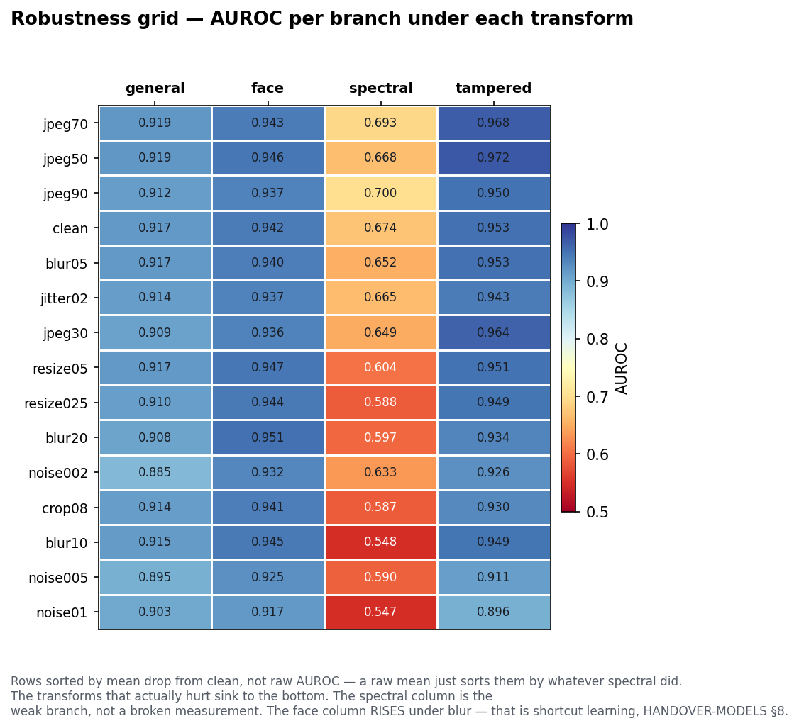
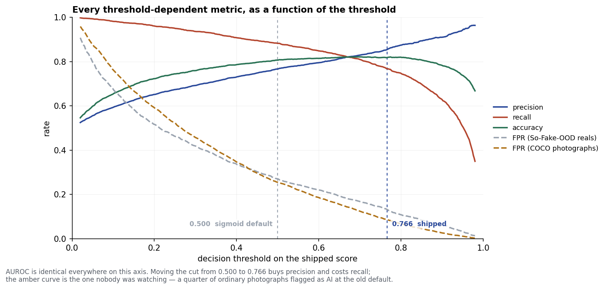
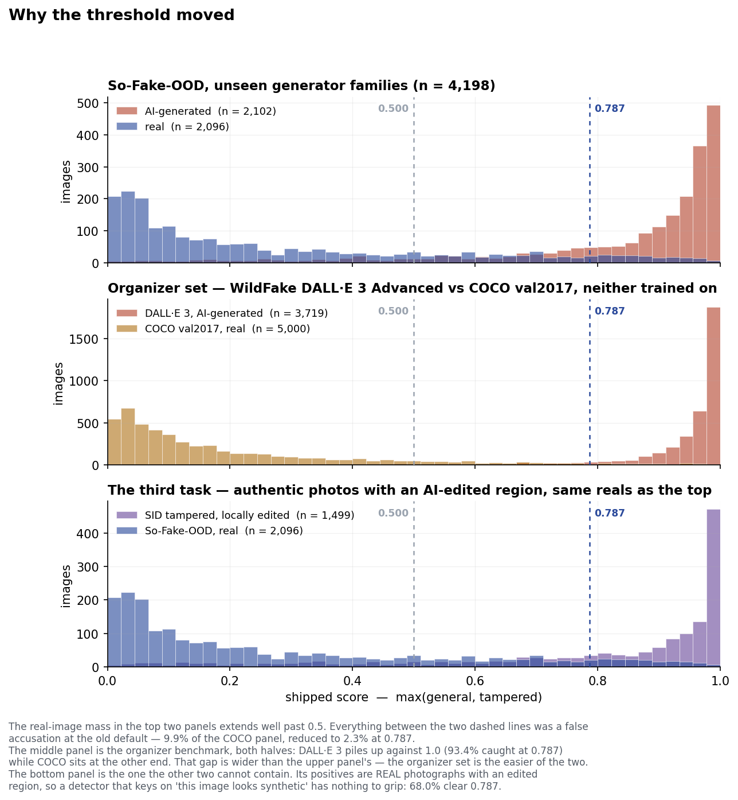

# Robustness Evaluation Summary

_Generated by scripts/eval_grid.py on `organizer_val`._

AUROC per branch under each degradation setting. The clean-to-worst **drop** is the robustness claim; a high mean with a large drop is a fragile detector.

## Per-branch summary

```
          clean  worst worst_variant   drop
general  0.9837 0.9729        crop08 0.0108
face     0.9520 0.8887        blur20 0.0633
spectral 0.6341 0.5199     resize025 0.1143
tampered 0.9069 0.7286       noise01 0.1782
```

## Full grid

```
           general   face  spectral  tampered
clean       0.9837 0.9520    0.6341    0.9069
blur05      0.9888 0.9541    0.6074    0.9110
blur10      0.9908 0.9401    0.6303    0.8847
blur20      0.9825 0.8887    0.5605    0.7893
crop08      0.9729 0.9341    0.5376    0.8464
jitter02    0.9831 0.9485    0.6230    0.8848
jpeg30      0.9866 0.9283    0.6706    0.9473
jpeg50      0.9871 0.9323    0.6863    0.9448
jpeg70      0.9895 0.9432    0.7311    0.9278
jpeg90      0.9873 0.9557    0.6073    0.9024
noise002    0.9845 0.9366    0.6289    0.8023
noise005    0.9815 0.9424    0.5948    0.7709
noise01     0.9854 0.9254    0.5591    0.7286
resize025   0.9854 0.9109    0.5199    0.9002
resize05    0.9844 0.9372    0.6170    0.8740
```



_Same numbers as a heatmap, rows sorted by mean drop from clean. Regenerate with `python scripts/make_figures.py robustness`._

## Where the decision is made

AUROC above is threshold-free and says nothing about whether the shipped cut works. It did not: 0.5 was the sigmoid default and flagged a quarter of COCO photographs as AI. `predict.py` now cuts at an operating point picked on `calib_ood`.





## Combiners, on the full task

`FULL` pools So-Fake-OOD (fully-synthetic) with sid_tampered_eval (locally edited) against the same real pool. The general probe is *inverted* on tampering, so a single-branch score that looks strong on one column collapses on the other.

```
               FULL avg  FULL worst  organizer_val clean  organizer_val worst
general alone    0.8849      0.8564               0.9837               0.9729
max(gen,tamp)    0.9113      0.8379               0.9541               0.8841
fusion LR        0.8960      0.8341               0.9521               0.8900
```

The task is **disjunctive** -- "AI touched this" = fully-synthetic OR locally edited -- so `max` beats a linear combiner in log-odds space, which is forced into one additive trade-off across two complementary detectors. `predict.py` ships `max` on this measurement.

The generator-disjoint calibration slice that was once the open data task now exists (`calib_ood`, carved by generator FAMILY) and **fusion still does not win**: it reaches parity on the headline only by scoring 0.38 on tampering, or handles tampering only by dropping ~6 points on the headline. `HANDOVER.md` sections 5c and 5e carry both fit sets.
